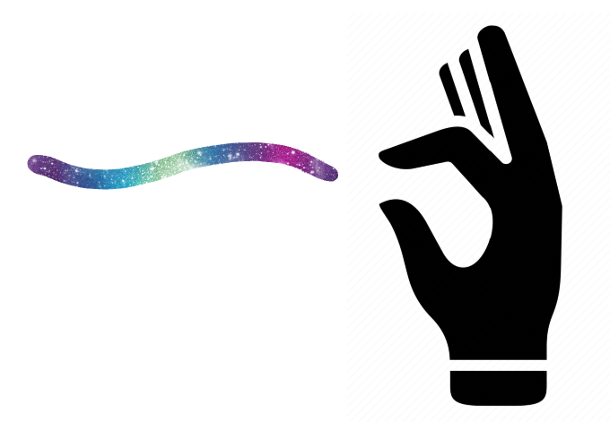

<a name="readme-top"></a>

<!--
*** Thanks to Othneildrew for this great Readme template! Go check it out https://github.com/othneildrew/Best-README-Template
-->


<!-- PROJECT SHIELDS -->
<!--
*** I'm using markdown "reference style" links for readability.
*** Reference links are enclosed in brackets [ ] instead of parentheses ( ).
*** See the bottom of this document for the declaration of the reference variables
*** for contributors-url, forks-url, etc. This is an optional, concise syntax you may use.
*** https://www.markdownguide.org/basic-syntax/#reference-style-links
-->
[![Contributors][contributors-shield]][contributors-url]
[![Forks][forks-shield]][forks-url]
[![Stargazers][stars-shield]][stars-url]
[![Issues][issues-shield]][issues-url]
[![MIT License][license-shield]][license-url]
[![LinkedIn][linkedin-shield]][linkedin-url]


<!-- PROJECT LOGO -->
<br />
<div align="center">
  <a href="https://github.com/PeriniM/HandsEase">
    
  </a>

<h3 align="center">HandsEase Open Project</h3>

  <p align="center">
    Open source template for hand detection webapps. You can build drawing apps, manipulate 3D objects on the web and so on.
    <br />
    All you need is a webcam!
    <br /><br />
    <a href="https://github.com/PeriniM/HandsEase"><strong>Explore the docs »</strong></a>
    <br />
    <br />
    <a href="https://github.com/PeriniM/HandsEase">View Demo</a>
    ·
    <a href="https://github.comPeriniM/HandsEase/issues">Report Bug</a>
    ·
    <a href="https://github.com/PeriniM/HandsEase/issues">Request Feature</a>
  </p>
</div>


<!-- TABLE OF CONTENTS -->
<details>
  <summary>Table of Contents</summary>
  <ol>
    <li>
      <a href="#about-the-project">About The Project</a>
      <ul>
        <li><a href="#built-with">Built With</a></li>
      </ul>
    </li>
    <li>
      <a href="#getting-started">Getting Started</a>
      <ul>
        <li><a href="#prerequisites">Prerequisites</a></li>
        <li><a href="#installation">Installation</a></li>
      </ul>
    </li>
    <li><a href="#usage">Usage</a></li>
    <li><a href="#roadmap">Roadmap</a></li>
    <li><a href="#contributing">Contributing</a></li>
    <li><a href="#license">License</a></li>
    <li><a href="#contact">Contact</a></li>
    <li><a href="#acknowledgments">Acknowledgments</a></li>
  </ol>
</details>


<!-- ABOUT THE PROJECT -->
## About The Project

[![Product Name Screen Shot][product-screenshot]](https://example.com)

Open source template for hand detection webapps. You can build drawing apps, manipulate 3D objects on the web and so on.

<p align="right">(<a href="#readme-top">back to top</a>)</p>


### Built With

[![Nodejs][Node.js]][Node-url]
[![Webpack][Webpack]][Webpack-url]
[![Tensorflowjs][Tensorflow.js]][Tensorflow-url]
[![Threejs][Three.js]][Three-url]
[![P5js][P5.js]][P5-url]

<p align="right">(<a href="#readme-top">back to top</a>)</p>


<!-- GETTING STARTED -->
## Getting Started

To get a local copy up and running follow these simple example steps.

### Prerequisites

- Install Node.js from the main website [here](https://nodejs.org/en/)

Optional:

- Run the Docker container using the Visual Studio Code Dev Containers extension

### Installation

1. Clone the repo
   ```sh
   git clone https://github.com/PeriniM/HandsEase.git
   ```
2. Install NPM packages
   ```sh
   npm install
   ```
3. To run it in a local web server
   ```sh
   npm run start
   ```
4. If you just want to build it
```sh
   npm build
   ```

<p align="right">(<a href="#readme-top">back to top</a>)</p>


<!-- USAGE EXAMPLES -->
## Usage


https://user-images.githubusercontent.com/19621159/223075567-c6e3ce81-6fb2-4bd1-98bd-ba0dd4d2dcfe.mp4


_For more examples, please refer to the [Documentation](https://example.com)_

<p align="right">(<a href="#readme-top">back to top</a>)</p>


<!-- ROADMAP -->
## Roadmap
- Folders organization: https://mapstore2.readthedocs.io/en/new_merge_doc/developer-guide/project-structure/

#### DETECTION MODEL 
- [x] Use tensorflowjs model
  - https://github.com/tensorflow/tfjs-models/tree/master/hand-pose-detection
  - https://machinelearningknowledge.ai/tensorflow-js-hand-gesture-recognition-and-tracking-using-handpose-model/
- [ ] Move the computation to a parallel "thread" using Web Workers (working only on tfjs models)
  - https://stackoverflow.com/questions/64249599/how-to-run-handpose-tfjs-model-in-web-worker
  - https://hacks.mozilla.org/2011/12/faster-canvas-pixel-manipulation-with-typed-arrays/
- [ ] Implement Linear Kalman Filter
  - https://ethz.ch/content/dam/ethz/special-interest/baug/igp/photogrammetry-remote-sensing-dam/documents/pdf/Student_Theses/BA_Laumer-Gumgumcu_final.pdf
  - https://nbviewer.org/github/rlabbe/Kalman-and-Bayesian-Filters-in-Python/blob/master/00-Preface.ipynb
- [ ] Implement gesture detection model

#### GRAPHICS
- [x] Port the app in threejs
- [ ] Add 3D Gizmo
- [ ] Add grid floor
- [ ] Add a mockup for the rig of the hands (like transparent hands 3d model)

#### INTERACTION
- [ ] "OK" gesture should pick things and also draw
- [ ] Implement rotation and pan with the other hand
- [ ] Double "OK" gesture allow the user to rotate and scale objects

See the [open issues](https://github.com/PeriniM/HandsEase/issues) for a full list of proposed features (and known issues).

<p align="right">(<a href="#readme-top">back to top</a>)</p>


<!-- CONTRIBUTING -->
## Contributing

Contributions are what make the open source community such an amazing place to learn, inspire, and create. Any contributions you make are **greatly appreciated**.

If you have a suggestion that would make this better, please fork the repo and create a pull request. You can also simply open an issue with the tag "enhancement".
Don't forget to give the project a star! Thanks again!

1. Fork the Project
2. Create your Feature Branch (`git checkout -b feature/AmazingFeature`)
3. Commit your Changes (`git commit -m 'Add some AmazingFeature'`)
4. Push to the Branch (`git push origin feature/AmazingFeature`)
5. Open a Pull Request

<p align="right">(<a href="#readme-top">back to top</a>)</p>


<!-- LICENSE -->
## License

Distributed under the MIT License. See `LICENSE.txt` for more information.

<p align="right">(<a href="#readme-top">back to top</a>)</p>


<!-- CONTACT -->
## Contact

Marco Perini - [@linkedin](https://www.linkedin.com/in/perinim/)

Project Link: [HandsEase Repo](https://github.com/PeriniM/HandsEase)

<p align="right">(<a href="#readme-top">back to top</a>)</p>


<!-- ACKNOWLEDGMENTS -->
## Acknowledgments

* []()
* []()
* []()

<p align="right">(<a href="#readme-top">back to top</a>)</p>


<!-- MARKDOWN LINKS & IMAGES -->
<!-- https://www.markdownguide.org/basic-syntax/#reference-style-links -->
[contributors-shield]: https://img.shields.io/github/contributors/PeriniM/HandsEase.svg?style=for-the-badge
[contributors-url]: https://github.com/PeriniM/HandsEase/graphs/contributors
[forks-shield]: https://img.shields.io/github/forks/PeriniM/HandsEase.svg?style=for-the-badge
[forks-url]: https://github.com/PeriniM/HandsEase/network/members
[stars-shield]: https://img.shields.io/github/stars/PeriniM/HandsEase.svg?style=for-the-badge
[stars-url]: https://github.com/PeriniM/HandsEase/stargazers
[issues-shield]: https://img.shields.io/github/issues/PeriniM/HandsEase.svg?style=for-the-badge
[issues-url]: https://github.com/PeriniM/HandsEase/issues
[license-shield]: https://img.shields.io/github/license/PeriniM/HandsEase.svg?style=for-the-badge
[license-url]: https://github.com/PeriniM/HandsEase/blob/master/LICENSE
[linkedin-shield]: https://img.shields.io/badge/-LinkedIn-black.svg?style=for-the-badge&logo=linkedin&colorB=555
[linkedin-url]: https://linkedin.com/in/perinim
[product-screenshot]: images/screenshot.png
[Node.js]: https://img.shields.io/badge/node.js-6DA55F?style=for-the-badge&logo=node.js&logoColor=white
[Node-url]: https://nodejs.org/en/
[Webpack]: https://img.shields.io/badge/webpack-%238DD6F9.svg?style=for-the-badge&logo=webpack&logoColor=black
[Webpack-url]: https://webpack.js.org/
[Tensorflow.js]: https://img.shields.io/badge/TensorFlow-%23FF6F00.svg?style=for-the-badge&logo=TensorFlow&logoColor=white
[Tensorflow-url]: https://www.tensorflow.org/
[Three.js]: https://img.shields.io/badge/threejs-black?style=for-the-badge&logo=three.js&logoColor=white
[Three-url]: https://threejs.org/
[p5.js]: https://img.shields.io/badge/p5.js-ED225D?style=for-the-badge&logo=p5.js&logoColor=FFFFFF
[p5-url]: https://p5js.org/
[React-url]: https://reactjs.org/
